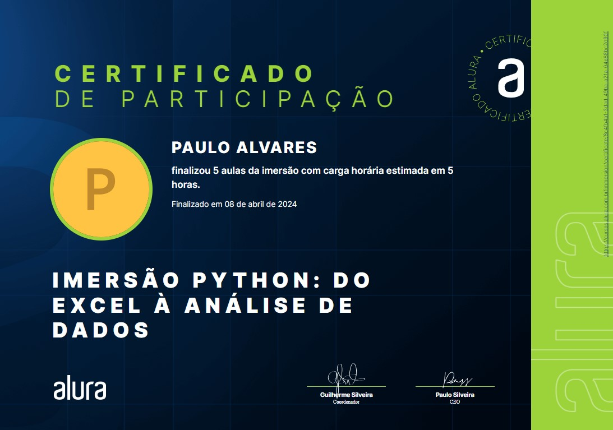

  
  <h3 align="center">Imersão Python - Alura</h3>

# 🎯Objetivo
  Este curso oferece uma introdução abrangente à análise de dados com Python, abordando desde a manipulação básica de dados até técnicas avançadas de previsão. O curso explora a análise exploratória com ferramentas como o Google Sheets, Jupyter Notebook, geração de tabelas e gráficos, e manipulação de dados utilizando bibliotecas poderosas do Python. Além disso, aprofunda-se em análises avançadas, como gráficos de velas e previsão de séries temporais de ações. Meu objetivo é dominar esses tópicos para aprimorar minhas habilidades na análise de dados e criar soluções preditivas e visualmente impactantes que agreguem valor ao processo de tomada de decisão.

# 📚Conteúdo Abordado
  * **Análise Exploratória com Google Sheets:** Introdução à análise de dados utilizando o Google Sheets para explorar, visualizar e compreender grandes volumes de dados. Também abrange o uso das principais funções e fórmulas para cálculos e sumarizações.

  * **Gerando Tabelas e Criando Gráficos:** Criação de tabelas e gráficos para auxiliar na análise de dados e na identificação de tendências e padrões.

  * **Manipulação de Dados com Bibliotecas Python:** Exploração das principais bibliotecas de Python para manipulação de dados, como Pandas. Aborda a importação, limpeza e transformação de dados, além de operações como agrupamento, filtragem e agregação. São apresentadas técnicas para lidar com dados ausentes, duplicados e inconsistentes.

  * **Análises Avançadas e Gráficos de Velas:** Geração de gráficos avançados para análise de dados, utilizando bibliotecas como Matplotlib e Seaborn. Inclui a criação de gráficos de barras, linhas, dispersão, histogramas e gráficos de velas, com foco na construção de visualizações que facilitem a interpretação de resultados e a tomada de decisões.

  * **Previsão de Séries Temporais de Ações:** Introdução aos conceitos e técnicas para previsão de séries temporais, com foco em dados financeiros. Aborda a análise de padrões temporais, decomposição de séries, e a aplicação de modelos estatísticos e de machine learning para previsão de valores futuros.

# 🏅Certificado

# 🔗Recursos Adicionais
### 🔧Ferramentas
  - <a href="https://docs.google.com/spreadsheets/u/0/?tgif=d">Google Sheets</a>
  - 

### 📦Linguagens e Pacotes
  - <a href="https://www.python.org/downloads/">Python</a>
  - <a href="https://jupyter.org/install">Jupyter Notebook</a>

### 📖Guias de Referência
  - <a href="https://docs.python.org/3/">Python</a>
  - <a href="https://docs.jupyter.org/en/latest/">Jupyter Notebook</a>

### 📎Curso
  - <a href="https://www.alura.com.br/imersao-python-curso-gratuito?utm_source=Youtube&utm_medium=Live-de-abertura&utm_campaign=imersao-python">Imersão Python</a>

# 📬Contato

 
  
  
   
  
  
  

